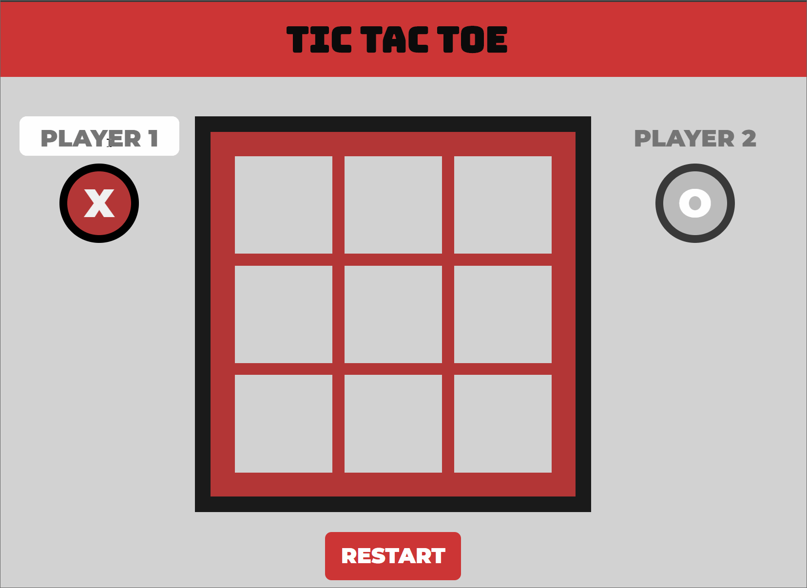

# tic-tac-toe
Tic Tac Toe created with Javascript.

This simple implementation of Tic Tac Toe was created to help practice how to structure code with factory functions and the Module Pattern.

Preview (GIF)
--------------

